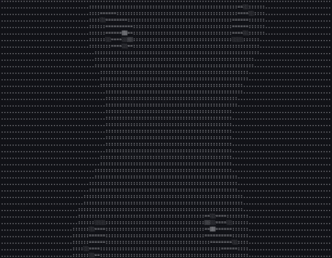

# ASCII renderer

🚧 WIP 🚧

## Demos

#### 3d cube


#### [DOOM fire](http://fabiensanglard.net/doom_fire_psx/)


#### fractal



#### wave shader

[](https://asciinema.org/a/210121)

#### pulsar shader and another grayscale palette


#### wireframe of 3d cube


## Used materials

- http://www.opengl-tutorial.org/beginners-tutorials
- https://github.com/ssloy/tinyrenderer/wiki (only first 2 tuts so far)
- https://fenix.tecnico.ulisboa.pt/downloadFile/3779573130568/The

## Usage (so far just tests)

```bash
# 3d cube
./run.py 3d
# shader magic
./run.py shader
```

## TODO

- [ ] logically split code (because now it's just a mess grouped in random files)
- [x] add basic shading directly mapped to screen
- [ ] 3d model rendering
  - [x] load hardcoded model vertices/faces
  - [x] render wireframe
  - [x] render filled faces (with colors based on normals and camera direction)
  - [ ] allow to apply all kind of transformations on vertices
  - [ ] add texture
  - [ ] add vertex shaders (?)
  - [ ] add fragment shaders
- [ ] allow to change camera position/rotation
- [ ] add perspective projection
- [ ] add basic lighting
- [ ] allow to add multiple models
- [ ] load models from files
- [ ] separate rendering pipeline, scene setup and "game logic"
- [ ] add keyboard control (if possible)
- [ ] ...
