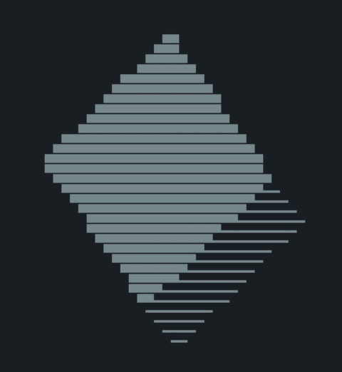
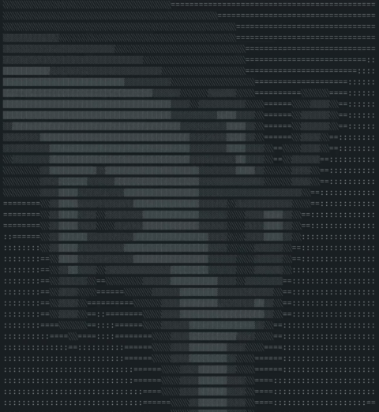

# ASCII renderer

🚧 WIP 🚧

## Demos

#### [3d stuff](demos/README.md#3d-stuff)



#### [shaders](demos/README.md#shaders)

[](https://asciinema.org/a/210121)

## Used materials

- http://www.opengl-tutorial.org/beginners-tutorials
- https://github.com/ssloy/tinyrenderer/wiki (only first 2 tuts so far)
- https://fenix.tecnico.ulisboa.pt/downloadFile/3779573130568/The

## Usage (so far just tests)

```bash
# 3d cube
./run.py 3d
# shader magic
./run.py shader
```

## [TODO](TODO.md)
